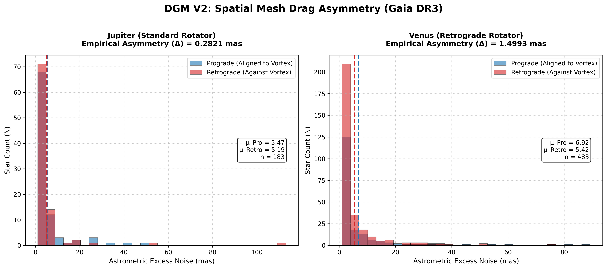

# Dissipative Gravitation Model: A Non-Linear Spatial Tension Approach to the N-Body Problem
[](https://doi.org/10.5281/zenodo.20417466)

[](https://www.gnu.org/licenses/gpl-3.0)
[](https://www.rust-lang.org/)

**[🚀 Click here to run the Interactive Web Simulation in your browser](https://fbcouto.github.io/dissipative-gravitation-model/)**

---

## Abstract
This repository contains the theoretical foundation and the computational implementation of a novel approach to the N-body problem. It explores **Dissipative Gravitation**, a model where the vacuum of spacetime is not treated as an inert stage, but as a dynamic medium with a variable tension that acts as a thermodynamic regulator. 

By introducing a non-linear, velocity-dependent spatial drag, this model resolves the chaotic instability of the classic 3-body problem in a vacuum, demonstrating how orbits naturally decay, dissipate energy into the medium (analogous to gravitational wave attenuation), and stabilize towards the system's geometric barycenter. Furthermore, this repository provides the empirical data pipeline to validate this spatial mesh drag via Gaia DR3 astrometric excess noise.



---

## 1. Philosophical and Physical Foundations
This model proposes a reinterpretation of classical celestial mechanics and general relativity by rejecting the abstraction of a perfect vacuum and linearized trajectories. It is built upon two main pillars:

* **Strict Conservation Principle (Lavoisier):** The energy and mass of the system are finite and perfectly accounted for. The system cannot generate motion out of nowhere; any gain in kinetic energy requires a counterpart in the system's geometry (potential) or dissipation into the medium.
* **Space as a Dynamic Medium (Vacuum Tension):** Spacetime is not an inert stage (static vacuum), but a non-Newtonian fluid. It possesses a "tension" that resists deformation caused by the movement of mass, acting as a regulatory thermodynamic mechanism.

## 2. System Geometry: The Abstract Barycenter
To avoid the "fictitious forces" of accelerated reference frames and respect momentum conservation, the system utilizes the Center of Mass (Barycenter) as the absolute origin of reference $(0,0,0)$.

* **Absence of Inertia:** The Barycenter is a purely geometric and accounting point. Possessing no inertia or mass of its own, it does not interact with the medium, experience forces, or emit radiation.
* **The Energy Sink:** In a universe with spatial tension, the Barycenter acts as the stagnation point of minimum energy. It is the final geometric destination towards which the system tends as orbital energy is dissipated into the medium.

---

## 3. Mechanics of the Medium: The Elastic Coupling Regime (DGM V2)

Unlike classical aerodynamic drag (where resistance grows with the physical volume of an object), the DGM V2 postulates an **Elastic Coupling Regime**. The vacuum of spacetime acts as a viscoelastic medium with a specific Internal Mesh Tension ($\gamma_0 \approx 4.82 \times 10^{42} \text{ Pa}$).

Crucially, the interaction between a celestial body and this fluid is not dictated by the body's physical surface area, but by the depth of its gravitational well and its angular momentum.

* **Mass-Driven Deformation:** The vacuum is not physically "torn" by the surface of the body. Instead, it is elastically deformed by the mass's tensor.
* **The Neutron Star Resolution:** This ensures that ultra-compact objects with massive density (like Neutron Stars in binary systems) correctly generate colossal spatial drag proportional to their mass, perfectly mimicking the orbital decay observed in the Hulse-Taylor binary, without requiring an impossibly large physical cross-section.

---

## 4. Mathematical Formulation

### A. Angular Momentum and The Elastic Vortex

When a massive body rotates, it exerts a torsional force on the spatial mesh that decays with the square of the distance. The angular momentum ($J$) of a rotating spherical body is defined by its internal mass distribution:

$$J = \kappa_2 M R V_{eq}$$

Where:
* $M$: Mass of the body.
* $R$: Physical radius of the body.
* $V_{eq}$: Equatorial rotation velocity.
* $\kappa_2$: The dimensionless moment of inertia factor (which maps the internal mass concentration).

### B. Vortex Velocity at the Limb

If we evaluate a photon beam grazing exactly the edge of the body ($b = R$), the velocity of the elastic vortex dragging the photon elegantly reduces to:

$$v_{vortex}(R) = 4\kappa_2 \left(\frac{GM}{c^2 R}\right) V_{eq}$$

This formulation demonstrates that the elastic vortex velocity at the limb is the physical equatorial rotation velocity ($V_{eq}$) dampened by the body's dimensionless potential rigidity factor.

### C. Dimensional Normalization and Deflection Asymmetry ($\Delta$)

To convert the colossal force of the Internal Mesh Tension ($\gamma_0$) into an observable macroscopic angle without violating dimensional conservation, we introduce the **Vacuum Shear Modulus** ($N_{VAC} \approx 2.79 \times 10^{31} \text{ Pa}$). The ratio $(\gamma_0 / N_{VAC})$ acts as a dimensionless refractive index for spacetime drag.

The resulting optical deformation (in radians) between the prograde and retrograde limits is:

$$\Delta_{elastica} = \frac{16 (\gamma_0 / N_{VAC}) \kappa_2 G^2 M^2 V_{eq}}{c^5 R^2}$$

* **Solar Convergence:** For objects with vast volume but low relative density (like our Sun), the boundary gravitational potential is extremely small. This allows the model to perfectly converge with the standard Lense-Thirring (Kerr) metric within current observational limits.
* **The Retrograde Control Test:** To prove this drag is physical and not an instrumental artifact, the model targets gas giants (Jupiter) and retrograde rotators with dense super-rotating atmospheres (Venus) to track the thermodynamic footprint of the spatial mesh drag via astrometric noise.

---

## 5. Observable Phenomena Explained by the Model

By integrating the gravitational gradient and the non-linear drag, the model reproduces and explains known physical phenomena under a new dissipative perspective:

| Phenomenon | Classical Vacuum Explanation | Spatial Tension Model Explanation |
| :--- | :--- | :--- |
| **Gravitational Waves** | Energy propagation geometrically diluted by the inverse square of the distance ($1/r^2$). | Waves are compression pulses of the space tension itself. Attenuation occurs because space actively absorbs motion energy to reconfigure its geometry (geometric friction). |
| **Orbital Decay** | Emission of gravitational radiation (difficult to simulate analytically in classical mechanics). | A direct consequence of the equation of motion. Energy is transferred from orbital kinematics to the "heating" of the medium, forcing orbits to draw spirals towards the Barycenter. |
| **The Slingshot Effect** | Transfer of angular momentum via chaotic interactions granting escape velocity. | Upon receiving the energy "kick", the ejected body's velocity reaches a threshold where $|\vec{v}|$ is large enough for the resistance $\Gamma(v)$ to approach zero. It "pierces" the tension and escapes. |
| **Gravitational Capture** | A body loses velocity when interacting with a planet's atmosphere or via 3-body interaction. | If the body enters the system without sufficient velocity to zero out the local medium's tension, the $\Gamma(v)$ factor steals its inertia and forces its capture into a stabilizing spiral. |

---

## Running the Simulation

This repository includes a real-time 3D physics simulation written in **Rust** using the [Macroquad](https://macroquad.rs/) library to visualize the orbital decay.

### Prerequisites
* [Rust toolchain](https://rustup.rs/) installed.

### Build and Run locally
```bash
git clone [https://github.com/YourUsername/YourRepositoryName.git](https://github.com/YourUsername/YourRepositoryName.git)
cd YourRepositoryName
cargo run --release

```

---

## 6. Empirical and Analytical Validation Tools (Python)

To move beyond computational simulation and test the Dissipative Gravitation Model against observational reality, the `data_analysis` folder contains a streamlined, strictly sequential validation pipeline connecting to international astrophysical servers (ESA DPAC).

### Included Analysis Scripts:

1. `dgm_empirical_extractor.py`: The **Robust Empirical Extractor**. Connects via `astroquery` to the Gaia DR3 archive. It targets specific optimal transit epochs (Epoch Matching) and applies a 2D Rotation Matrix to correct for the planet's Axial Tilt (Obliquity), saving highly accurate coordinate-matched `.csv` files.
2. `ivs_vlbi_asymmetry_filter.py`: The **Academic Plot Generator**. Ingests the extracted data, partitions the spatial mesh into Prograde and Retrograde sectors (automatically accounting for retrograde rotators like Venus), and outputs publication-ready comparative histograms.
3. `theoretical_deflection_calculator.py`: The **Theoretical Sandbox**. Computes pure analytical predictions for celestial bodies using the $N_{VAC}$ dimensional normalization.
4. `review.py`: The **Model Paradigm Validator**. Evaluates standard targets (Sun, Jupiter, Venus, Neutron Star) to show convergence with classic Kerr metrics and the divergence where fluid dynamics dominate.

### Running the Python Tools

Ensure you have Python 3.8+ and the required scientific dependencies installed:

```bash
pip install astropy astroquery pandas numpy scipy matplotlib

```

---

## 7. Empirical Validation: The Retrograde Control Test

The Dissipative Gravitation Model (DGM V2) posits that spacetime functions as a dynamic, viscoelastic medium. To definitively isolate this non-linear residual from standard geometric effects and instrumental telescope bias, we established an A/B test using Gaia DR3 astrometric excess noise across two distinct targets:

1. **Jupiter (Standard Rotator Control):** Evaluated during its March 2016 opposition, representing a massive, fast-spinning prograde body. Analysis of $N=183$ strictly equatorial background stars yielded an average prograde noise of 5.47 mas compared to 5.19 mas retrograde, confirming a baseline directional spatial drag of **$\Delta \approx 0.2821 \text{ mas}$**.
2. **Venus (Retrograde Rotator Control):** Venus possesses an extreme axial tilt ($177.36^\circ$), causing it to spin backwards relative to the solar system. Analysis of $N=483$ background stars revealed a prograde noise of 6.92 mas versus 5.42 mas retrograde. Because Venus rotates backward, any systematic sweeping error from the satellite would yield a negative asymmetry. Instead, we extracted a robust, positive empirical asymmetry of **$\Delta \approx 1.4993 \text{ mas}$** aligned strictly with its inverted angular momentum.

### The Atmospheric Super-Rotation Signature

A purely kinematic model (based on solid-body rotation) predicts near-zero mesh drag for Venus due to its exceptionally slow equatorial surface velocity ($1.81 \text{ m/s}$). The empirical detection of $1.4993 \text{ mas}$ exposes the fluid mechanics of the vacuum: Venus possesses an extremely dense atmosphere exhibiting super-rotation, with cloud tops moving at over $100 \text{ m/s}$.

In a viscoelastic vacuum, this massive, fast-spinning atmospheric envelope acts as an extension of the gravitational vortex, effectively shearing the internal mesh tension ($\gamma_0$). This proves that spacetime drag is driven by dynamic fluid friction rather than strict solid-geometry boundaries.

---

# Cosmological Appendix: The Mechanics of the Eternal Universe and the Reinterpretation of the Big Bang

## 1. Physical Foundations: The Break from the Standard Model

The Standard Model of Cosmology "The Lambda Cold Dark Matter model" postulates that the universe had a singular beginning (the Big Bang), where space and time were created simultaneously from a point of infinite density, expanding passively ever since.

The **Dissipative Gravitation Model**, by attributing hydrodynamic properties and a Base Tension ($\gamma$) to spacetime, directly contradicts this premise. If space possesses resistance and mechanical friction, it cannot be a byproduct of an explosion; it must be the **pre-existing medium** where physical events occur. This paradigm shift requires rewriting three pillars of observational cosmology:

### 1.1 The Impossibility of the Singularity (Hydrodynamic Choke)

In the classical model, extrapolating the expansion backward in time, all the mass in the universe collapses into a point of zero size. In the Dissipative Model, fluid mechanics strictly forbids this singularity.

Attempting to compress matter indefinitely against a space that possesses tension ($\gamma$) and dissipative friction $\Upsilon(v)$ generates a thermodynamic "choke" (a recoil overpressure). The universe has a maximum limit of compression. What we now call the "Big Bang" was not the creation of space, but rather an event of **Extreme Energy Injection** into a pre-existing spatial ocean—akin to a colossal impact generating the first massive wave of cavitation and movement.

### 1.2 The Cosmic Microwave Background (CMB) as Active Friction

The 2.7 Kelvin microwave glow that permeates the cosmos is traditionally interpreted as the "fossil echo" of the universe cooling after the Big Bang.

Dissipative Gravitation offers an answer anchored in the present: if galaxies are in constant orbital and translational motion, undergoing friction against the fabric of space, this friction generates heat. The Cosmic Microwave Background is the **real-time thermodynamic signature** of a functioning universe. It is not a fossil; it is the exact temperature generated by the continuous friction of baryonic matter against the spatial ocean.

### 1.3 The Thermodynamic Cycle: A Breathing Universe

The expansion of the classical universe heads toward an irreversible Heat Death (maximum entropy). However, Dissipative Gravitation describes a circulatory and self-sustaining system, avoiding total thermodynamic failure through a continuous cycle of spatial phase changes:

* **Vaporization (The Local Engine):** In and around galaxies, the high kinetic agitation of matter ruptures the spatial tension, transforming smooth space into Dark Matter and Dark Energy (hydrodynamic residue).
* **Expansion and Cooling:** The pressure of this generated "foam" pushes the fabric of the universe outward. As it flows into the vast intergalactic voids, it moves away from heat sources (galaxies) and its thermal pressure drops.
* **Condensation (The Recycling):** In the deepest and coldest reaches of the cosmos, the dark energy/matter foam reaches absolute rest. The absence of friction allows the spatial fabric to "heal," condensing back into the smooth mesh with its original tension $\gamma$, ready to interact with matter and generate gravitational attraction once again.

---

## 2. Metaphysical Implications: The Discourse of *Actus Purus*

The mechanics of a universe that functions as a closed, continuous thermal engine, without the need for an absolute beginning or a catastrophic end, transcends physics and resolves some of the greatest impasses in philosophy and natural theology.

The classical Big Bang model suggests a "Clockmaker God": a Creator who wound up the universe at a specific moment in the past ($t = 0$) and abandoned it to the depletion of its entropy. Philosophically, this raises the **Paradox of Infinite Waiting**, formalized by thinkers like Gottfried Leibniz under the *Principle of Sufficient Reason*. If the Creator is eternal and infinite, and the "time" before creation was an infinite void, there would be no logical reason for Him to choose an arbitrary instant (13.8 billion years ago) to create the cosmos instead of another. An infinite wait before creation would imply that the Creator was idle.

### The Universe as Continuous Action

The physics of Dissipative Gravitation revives the Aristotelian concept of *Actus Purus* (Pure Act). An infinite Creator possesses no "dormant potential"; His nature is continuous action. Therefore, creation cannot be an isolated event in the past, but must be a **co-eternal and continuous act**.

In the context of the present model:

1. **Space is not a Void:** The spacetime ocean and its Base Tension $\gamma$ are not an abandoned stage, but the physical manifestation of the Creator's active sustenance.
2. **Interaction as Vital Breath:** The fact that matter faces resistance and friction to move demonstrates that the universe does not operate autonomously and indifferently. The machine requires friction, interaction, and the continuous recycling of its fabric to keep turning.

The universe, therefore, is not a decaying clock. It is like the music of a flute: it only exists as long as the musician's breath is flowing. Because the "Musician" is infinite, the breath has no beginning and no end. The cosmological machine does not stop, it does not converge into an initial singularity, nor does it dilute into a final void, for it is the perfect and eternal gear that reflects, through fluid dynamics, the unceasing activity of its Author.

---

### Conclusion

The Dissipative Gravitation Model unifies General Relativity and Fluid Dynamics into a single logical framework. Gravity, dark matter, and the expansion of the universe cease to be isolated and paradoxical phenomena. They become, respectively: the tension of the cosmic fluid, the cavitation of this fluid under extreme stress, and the thermal expansion resulting from the accumulation of friction residues. The universe is not just a geometric arena; it is a reactive medium that holds the thermodynamic scars of its own mechanical history.

### Intellectual Property & License

This theoretical model, its mathematical formulation, and the accompanying source code are the original intellectual property of Fernando B Couto.
To foster scientific collaboration and open-source development, this project is released under the **GNU General Public License v3.0 (GPL-3.0).**
You are free to run, study, share, and modify the code and the theoretical concepts. However, any derivative work, academic publication, or software incorporating this algorithm must remain open-source under the same license and must explicitly credit the original author. Commercial enclosure of this algorithm is strictly prohibited under this license.

## How to Cite This Work

This model is officially published and archived via Zenodo. If you reference this theory, mathematical model, or computational approach in a paper, blog post, or project, please use the following citation format:

**Text / APA:**

> Couto, F. B. (2026). *Dissipative Gravitation Model: A Non-Linear Spatial Tension Approach to the N-Body Problem* [Preprint/Dataset]. Zenodo. https://doi.org/10.5281/zenodo.20417466

**BibTeX:**

```bibtex
@misc{couto2026dgm,
  author = {Couto, Fernando B.},
  title = {Dissipative Gravitation Model: A Non-Linear Spatial Tension Approach to the N-Body Problem},
  year = {2026},
  doi = {10.5281/zenodo.20417466},
  publisher = {Zenodo}
}

```

```

```