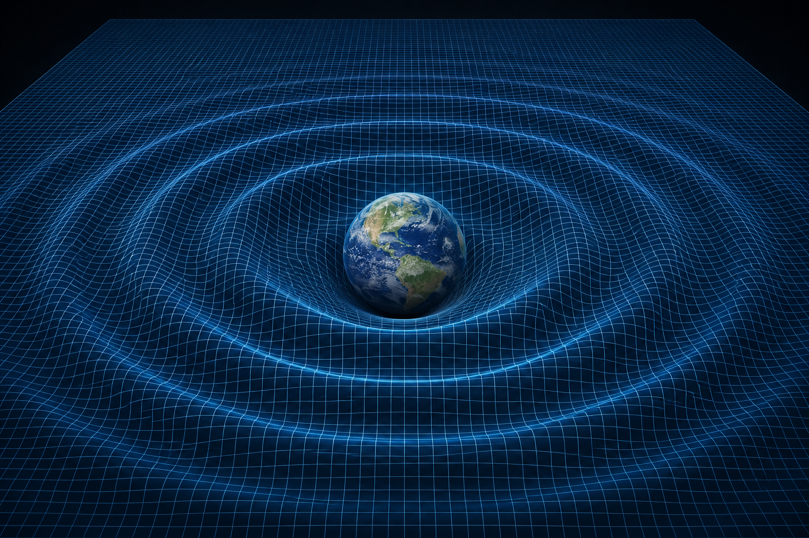

# Dissipative Gravitation Model: A Non-Linear Spatial Tension Approach to the N-Body Problem

[](https://www.gnu.org/licenses/gpl-3.0)
[](https://www.rust-lang.org/)

**[🚀 Click here to run the Interactive Web Simulation in your browser](https://fbcouto.github.io/dissipative-gravitation-model/)**

...
## Abstract
This repository contains the theoretical foundation and the computational implementation of a novel approach to the N-body problem. It explores **Dissipative Gravitation**, a model where the vacuum of spacetime is not treated as an inert stage, but as a dynamic medium with a variable tension that acts as a thermodynamic regulator. 

By introducing a non-linear, velocity-dependent spatial drag, this model resolves the chaotic instability of the classic 3-body problem in a vacuum, demonstrating how orbits naturally decay, dissipate energy into the medium (analogous to gravitational wave attenuation), and stabilize towards the system's geometric barycenter.


---

## 1. Philosophical and Physical Foundations
This model proposes a reinterpretation of classical celestial mechanics and general relativity by rejecting the abstraction of a perfect vacuum and linearized trajectories. It is built upon two main pillars:

* **Strict Conservation Principle (Lavoisier):** The energy and mass of the system are finite and perfectly accounted for. The system cannot generate motion out of nowhere; any gain in kinetic energy requires a counterpart in the system's geometry (potential) or dissipation into the medium.
* **Space as a Dynamic Medium (Vacuum Tension):** Spacetime is not an inert stage (static vacuum), but a non-Newtonian fluid. It possesses a "tension" that resists deformation caused by the movement of mass, acting as a regulatory thermodynamic mechanism.

## 2. System Geometry: The Abstract Barycenter
To avoid the "fictitious forces" of accelerated reference frames and respect momentum conservation, the system utilizes the Center of Mass (Barycenter) as the absolute origin of reference $(0,0,0)$.

* **Absence of Inertia:** The Barycenter is a purely geometric and accounting point. Possessing no inertia or mass of its own, it does not interact with the medium, experience forces, or emit radiation.
* **The Energy Sink:** In a universe with spatial tension, the Barycenter acts as the stagnation point of minimum energy. It is the final geometric destination towards which the system tends as orbital energy is dissipated into the medium.

## 3. Mechanics of the Medium: Inversely Proportional Tension
Unlike classical aerodynamic drag (where resistance grows with velocity), the model postulates that the fabric of space behaves analogously to a supercritical flow: **the tension of the medium decreases as the body's velocity increases**.

This creates a non-linear inertia mechanism:
* **Low Velocity:** Space is "rigid" and offers high resistance, forcing the body to lose energy rapidly.
* **High Velocity:** The body "pierces" the space tension (tunneling effect), sliding with minimal resistance and approaching classical inertial behavior.

---

## 4. Mathematical Formulation

### A. The Space Tension Function $\Gamma(v)$
To quantify the medium's resistance as a function of velocity $\vec{v}$, we define the scalar attenuation function:

$$\Gamma(v) = \frac{\gamma}{v_0 + |\vec{v}|^\alpha}$$

Where:
* $\gamma$: **Base Space Tension** (rigidity constant of the fabric at rest).
* $v_0$: **Stagnation threshold** (minimum value to prevent mathematical singularity when $\vec{v} = 0$).
* $\alpha$: **Space yield factor** (defines the rate of resistance drop; $\alpha = 1$ for linear decay relative to velocity).

The resistance force (spatial drag) applied against the body's motion is:

$$\vec{F}_{res} = - \Gamma(v) \vec{v}$$

### B. The Modified Equation of Motion
For a body $i$ of mass $m_i$, the total acceleration is the vector sum of the gravitational curvature gradient (attraction from all other bodies $j$) and the resistance generated by the spatial tension. The differential equation governing the system's motion becomes:

$$m_i \frac{d^2\vec{r}_i}{dt^2} = \sum_{j \neq i} \frac{G m_i m_j}{|\vec{r}_j - \vec{r}_i|^3} (\vec{r}_j - \vec{r}_i) - \left( \frac{\gamma}{v_0 + |\vec{v}_i|^\alpha} \right) \frac{d\vec{r}_i}{dt}$$

### C. Thermodynamics and Energy Dissipation
The variation of the system's total energy ($E$) over time is not zero (as in a Hamiltonian vacuum), but strictly negative. The work done by space against the bodies is:

$$\frac{dE}{dt} = - \sum_{i=1}^{n} \frac{\gamma}{v_0 + |\vec{v}_i|^\alpha} |\vec{v}_i|^2$$

Since $\frac{dE}{dt} < 0$, the system guarantees progressive orbital attenuation until the masses converge at the Barycenter.

---

## 5. Observable Phenomena Explained by the Model

By integrating the gravitational gradient and the non-linear drag, the model reproduces and explains known physical phenomena under a new dissipative perspective:

| Phenomenon | Classical Vacuum Explanation | Spatial Tension Model Explanation |
| :--- | :--- | :--- |
| **Gravitational Waves and Attenuation** | Energy propagation geometrically diluted by the inverse square of the distance ($1/r^2$). | Waves are compression pulses of the space tension itself. Attenuation occurs because space actively absorbs motion energy to reconfigure its geometry (geometric friction). |
| **Orbital Decay** | Emission of gravitational radiation (difficult to simulate analytically in classical mechanics without explicit mass/energy loss). | A direct consequence of the equation of motion. Energy is transferred from orbital kinematics to the "heating" of the medium, forcing orbits to draw spirals towards the Barycenter. |
| **The Slingshot Effect (Escape)** | Transfer of angular momentum via chaotic interactions granting escape velocity to a third body. | Upon receiving the energy "kick" from more massive bodies, the ejected body's velocity reaches a threshold where $\|\vec{v}$ is large enough for the resistance $ $\Gamma($ to approach zero. It "pierces" the tension and escapes into straight-line inertia.|\vec{v}|$ is large enough for the resistance $\Gamma(v)$ to approach zero. It "pierces" the tension and escapes into straight-line inertia. |
| **Gravitational Capture** | A body loses velocity when interacting with a planet's atmosphere or via complex 3-body interaction. | If the body enters the system without sufficient velocity to zero out the local medium's tension, the $\Gamma(v)$ factor dominates its trajectory, stealing its inertia and forcing its capture into a stabilizing spiral. |

---

## Running the Simulation

This repository includes a real-time 2D physics simulation written in **Rust** using the [Macroquad](https://macroquad.rs/) library to visualize the orbital decay.

### Prerequisites
* [Rust toolchain](https://rustup.rs/) installed.

### Build and Run locally
```bash
git clone [https://github.com/YourUsername/YourRepositoryName.git](https://github.com/YourUsername/YourRepositoryName.git)
cd YourRepositoryName
cargo run --release
```
# Theoretical Appendix: Relativistic Implications and the Hydrodynamics of Spacetime

## 1. Introduction: From Geometry to Fluids
The classical model of Einstein's General Relativity describes spacetime as a passive and perfectly elastic geometry, where energy and momentum are strictly conserved locally. The **Dissipative Gravitation Model** proposes a paradigm shift: the vacuum is neither empty nor perfectly smooth, but rather a physical medium with properties analogous to fluid mechanics (viscoelasticity and mechanical tension). 

By introducing a velocity-dependent drag, the universe ceases to be purely kinematic and becomes a thermodynamic machine. This document formalizes the logical consequences of this premise applied to relativistic limits, revealing hydrodynamic solutions to the greatest mysteries of modern cosmology: the speed of light, Dark Matter, and Dark Energy.

---

## 2. Dissipative Relativity and the Modified Field Equation

To accommodate spatial friction, relativistic mathematics requires the reintroduction of a local absolute reference frame (the Barycenter's rest field). The equation of motion (Geodesic), which traditionally equates a body's acceleration solely to the curvature of space, must now include a contravariant continuous dissipation term.

### The Dissipative Geodesic
The trajectory of a mass is no longer dictated solely by geometry, but by the resistance of the medium:
$$\frac{d^2 x^\mu}{d\tau^2} + \Gamma^\mu_{\rho\sigma} \frac{dx^\rho}{d\tau} \frac{dx^\sigma}{d\tau} = - \Upsilon(v) \left( u^\mu - U^\mu_{bg} \right)$$

Where:
* $\Gamma^\mu_{\rho\sigma}$ represents the Christoffel Symbols (classical geometric curvature).
* $u^\mu$ is the four-velocity of the object.
* $U^\mu_{bg}$ is the four-velocity of the background spatial reference frame (Barycenter).
* $\Upsilon(v)$ is the Spatial Tension Tensor of the Dissipative Model.

### Thermodynamic Conservation of the Vacuum

For the First Law of Thermodynamics (Lavoisier) to be respected, the kinetic energy stolen from matter by spatial friction cannot disappear. Einstein's field equation must be altered to include the vacuum as an active thermodynamic sink. We replace the cosmological constant ($\Lambda$) with a Medium Dissipation Tensor $\mathcal{D}_{\mu\nu}$:

$$R_{\mu\nu} - \frac{1}{2}R g_{\mu\nu} = \frac{8\pi G}{c^4} \left( T_{\mu\nu}^{(Matter)} + \mathcal{D}_{\mu\nu}^{(Vacuum)} \right)$$

Strict energy conservation becomes a symmetric exchange between matter and the spatial fabric:

$$\nabla_\mu T^{\mu\nu}_{(Matter)} = - \nabla_\mu \mathcal{D}^{\mu\nu}_{(Vacuum)}$$

---

## 3. Spacetime Supercavitation and the Speed of Light

In Einstein's model, reaching the speed $c$ requires infinite energy due to the exponential increase in inertia. Under the lens of Dissipative Gravitation, the speed limit obeys laws of extreme hydrodynamics, specifically the phenomenon of **Supercavitation**.

### The Constant Friction Limit
Given the resistive force equation of the base model:
$$F_{res} = \left( \frac{\gamma}{v_0 + |v|} \right) v$$

When the velocity of the body tends to infinity ($v \gg v_0$), the mathematics demonstrate that the friction coefficient drops, but the drag force stabilizes exactly at the base tension of space ($\gamma$):
$$\lim_{v \to \infty} F_{res} = \gamma$$

**Physical Implication:** Space possesses a "yield strength" or "rupture tension". By accelerating aggressively and reaching the base tension $\gamma$, the body punctures the continuous fabric of spacetime. It creates a "tunnel" or "bubble" of near-zero resistance around itself. 

* **The Photon:** Massless particles at rest (photons) are born already in a state of supercavitation. They do not interact with the elastic tension of space, gliding perfectly through the tunnel created by their own velocity, justifying why light does not suffer orbital decay through friction.
* **Temporal Decoupling:** Inside the supercavitation bubble, matter is isolated from the thermodynamics of the external universe. The local time of the mass decouples from cosmic time, allowing apparent superluminal travel without violating causality (entropic isolation).

---

## 4. Dark Matter as a Phase Transition of Space

Fluid mechanics dictates that the interior of a cavitation bubble is not an absolute vacuum, but is rather filled by the original fluid in a low-pressure "vapor" state.

Applying this principle to the cosmos, **Dark Matter ceases to be classified as an undiscovered subatomic particle and becomes understood as a physical state of spacetime itself.** When the tension $\gamma$ of space is ruptured by the extreme movement of baryonic matter, space undergoes a phase transition. It "frays" or "tears", losing its ability to transmit mechanical friction or electromagnetic waves (light), while maintaining its passive attractive property.

**The Solution to Galactic Rotation Curves:**
Galaxies are not immersed in primordial clouds of dark matter. On the contrary: galaxies *generate* dark matter through continuous rotational supercavitation. Peripheral stars, orbiting at massive speeds against the tension of the universe, tear the local spacetime. The dark matter halo observed by telescopes is, in fact, the immense thermodynamic cavitation zone generated by the friction of the galaxy operating as a giant rotor.

---

## 5. Dark Energy and the Cosmic Web (The Thermodynamic Residue)

When thrust ceases, the supercavitation tunnel collapses. The surrounding space attempts to close in to restore equilibrium, causing a natural braking of the mass until it reaches rest. However, just as in torpedo hydrodynamics, this collapse does not instantly restore space to its original perfect state.

It leaves behind a hydrodynamic "wake" or scar: a residue of dark matter and gravitational turbulence.

* **The Cosmic Web:** The colossal filaments of dark matter that connect galaxy clusters are, therefore, fossil records of navigation. They map the trajectories torn by the colossal masses of the primordial universe in motion. These channels maintain a permanently reduced spatial tension $\gamma$, creating paths of least resistance through the cosmos.
* **The Origin of Dark Energy:** Over billions of years, the continuous friction of matter against the tension of space generates an increasing volume of this "vaporized residue". Dark Energy is redescribed in the model as the hydrodynamic or thermal pressure of this accumulated residue. The accelerated expansion of the universe is the mechanical result of the internal pressure of this residual "foam" pushing the boundaries of non-cavitated space outward, driven by the accumulation of thermodynamic dissipation from all orbits throughout the eons.
---

## 🌌 The Unified Hydrodynamic Framework: Macro & Micro Scales

This celestial mechanics engine serves as the macro-scale cosmological counterpart to the **[Deterministic Wave Engine (DWE)](https://github.com/fbcouto/deterministic-wave-engine)**. Together, they form a unified hydrodynamic theory of the universe, demonstrating that nature operates under the exact same deterministic fluid mechanics from the nanometric quantum realm to binary black holes.

While the DWE models sub-atomic particle trajectories, this repository applies the identical physical axioms to celestial bodies:

* **The Medium (Space Tension $\gamma_0$):** Both engines reject the "sterile vacuum" abstraction. Spacetime is modeled as a viscoelastic fluid with an inherent yield strength (Base Space Tension).
* **Macro/Micro Equivalence:** * *At the Micro-Scale (DWE):* $\gamma_0$ dictates the elastic boundary collisions and spin-wall friction that herd photon-vortices into Fraunhofer diffraction patterns (proving probability waves are merely emergent fluid dynamics).
  * *At the Macro-Scale (This Model):* $\gamma_0$ acts as the asymptotic limit for non-linear, velocity-dependent spatial drag ($v \to \infty = \gamma_0$), naturally stabilizing N-body chaos into harmonic orbits.
* **Decoherence as Gravitational Waves:** What quantum mechanics calls "wave-function collapse" (the destruction of a vortex's spin via friction) is the exact same mechanical phenomenon as macroscopic orbital dissipation. The attenuation of celestial orbits is simply kinetic energy bleeding into the fluid medium as thermodynamic wakes—currently interpreted by standard physics as Gravitational Waves.
* **Vortex Mechanics:** A rotating black hole dragging the local spacetime (Frame-Dragging / Lense-Thirring effect) is mathematically and conceptually identical to the quantum Double-Cone Vortex (Spindle) simulated in the HQPU architecture.

By connecting these two models, we prove that the universe does not switch rulebooks between the quantum and cosmic scales. It is governed entirely by fluidic determinism.


---
# Cosmological Appendix: The Mechanics of the Eternal Universe and the Reinterpretation of the Big Bang

## 1. Physical Foundations: The Break from the Standard Model

The Standard Model of Cosmology "The Lambda Cold Dark Matter model" postulates that the universe had a singular beginning (the Big Bang), where space and time were created simultaneously from a point of infinite density, expanding passively ever since. 

The **Dissipative Gravitation Model**, by attributing hydrodynamic properties and a Base Tension ($\gamma$) to spacetime, directly contradicts this premise. If space possesses resistance and mechanical friction, it cannot be a byproduct of an explosion; it must be the **pre-existing medium** where physical events occur. This paradigm shift requires rewriting three pillars of observational cosmology:

### 1.1 The Impossibility of the Singularity (Hydrodynamic Choke)
In the classical model, extrapolating the expansion backward in time, all the mass in the universe collapses into a point of zero size. In the Dissipative Model, fluid mechanics strictly forbids this singularity. 

Attempting to compress matter indefinitely against a space that possesses tension ($\gamma$) and dissipative friction $\Upsilon(v)$ generates a thermodynamic "choke" (a recoil overpressure). The universe has a maximum limit of compression. What we now call the "Big Bang" was not the creation of space, but rather an event of **Extreme Energy Injection** into a pre-existing spatial ocean—akin to a colossal impact generating the first massive wave of cavitation and movement.

### 1.2 The Cosmic Microwave Background (CMB) as Active Friction
The 2.7 Kelvin microwave glow that permeates the cosmos is traditionally interpreted as the "fossil echo" of the universe cooling after the Big Bang. 

Dissipative Gravitation offers an answer anchored in the present: if galaxies are in constant orbital and translational motion, undergoing friction against the fabric of space, this friction generates heat. The Cosmic Microwave Background is the **real-time thermodynamic signature** of a functioning universe. It is not a fossil; it is the exact temperature generated by the continuous friction of baryonic matter against the spatial ocean.

### 1.3 The Thermodynamic Cycle: A Breathing Universe
The expansion of the classical universe heads toward an irreversible Heat Death (maximum entropy). However, Dissipative Gravitation describes a circulatory and self-sustaining system, avoiding total thermodynamic failure through a continuous cycle of spatial phase changes:

* **Vaporization (The Local Engine):** In and around galaxies, the high kinetic agitation of matter ruptures the spatial tension, transforming smooth space into Dark Matter and Dark Energy (hydrodynamic residue).
* **Expansion and Cooling:** The pressure of this generated "foam" pushes the fabric of the universe outward. As it flows into the vast intergalactic voids, it moves away from heat sources (galaxies) and its thermal pressure drops.
* **Condensation (The Recycling):** In the deepest and coldest reaches of the cosmos, the dark energy/matter foam reaches absolute rest. The absence of friction allows the spatial fabric to "heal," condensing back into the smooth mesh with its original tension $\gamma$, ready to interact with matter and generate gravitational attraction once again.

---

## 2. Metaphysical Implications: The Discourse of *Actus Purus*

The mechanics of a universe that functions as a closed, continuous thermal engine, without the need for an absolute beginning or a catastrophic end, transcends physics and resolves some of the greatest impasses in philosophy and natural theology.

The classical Big Bang model suggests a "Clockmaker God": a Creator who wound up the universe at a specific moment in the past ($t = 0$) and abandoned it to the depletion of its entropy. Philosophically, this raises the **Paradox of Infinite Waiting**, formalized by thinkers like Gottfried Leibniz under the *Principle of Sufficient Reason*. If the Creator is eternal and infinite, and the "time" before creation was an infinite void, there would be no logical reason for Him to choose an arbitrary instant (13.8 billion years ago) to create the cosmos instead of another. An infinite wait before creation would imply that the Creator was idle.

### The Universe as Continuous Action
The physics of Dissipative Gravitation revives the Aristotelian concept of *Actus Purus* (Pure Act). An infinite Creator possesses no "dormant potential"; His nature is continuous action. Therefore, creation cannot be an isolated event in the past, but must be a **co-eternal and continuous act**.

In the context of the present model:

1. **Space is not a Void:** The spacetime ocean and its Base Tension $\gamma$ are not an abandoned stage, but the physical manifestation of the Creator's active sustenance.
2. **Interaction as Vital Breath:** The fact that matter faces resistance and friction to move demonstrates that the universe does not operate autonomously and indifferently. The machine requires friction, interaction, and the continuous recycling of its fabric to keep turning.

The universe, therefore, is not a decaying clock. It is like the music of a flute: it only exists as long as the musician's breath is flowing. Because the "Musician" is infinite, the breath has no beginning and no end. The cosmological machine does not stop, it does not converge into an initial singularity, nor does it dilute into a final void, for it is the perfect and eternal gear that reflects, through fluid dynamics, the unceasing activity of its Author over the 'Universal Cosmic Fluid'.
---
# Conjectural Appendix: A Framework for the Hydrodynamic Lifecycle

## 1. The Proposed Hydrodynamic Lifecycle

This study proposes a preliminary working hypothesis regarding the evolutionary dynamics of dense celestial bodies. While these objects are traditionally treated as geometric singularities, this conjecture posits that high-mass systems transition into dynamic, supercavitated states within the fluid spacetime medium. To align with observational astrophysics, we bifurcate this lifecycle into two distinct scales: **Micro-Hydrodynamic Cavitation** (Stellar-scale) and **Macro-Hydrodynamic Cavitation** (Galactic-scale).
```
┌────────────────────────────────────────────────────────────┐
│                 PRE-EXISTING SPATIAL OCEAN                 │
│              (Base Spatial Tension: \gamma)                │
└──────────────────────────────┬─────────────────────────────┘
                               │
                 ┌─────────────┴─────────────┐
                 ▼                           ▼

      [HIGH TRANSLATION: v]       [HIGH ROTATION: \omega]
      Stellar natal kicks /       Galactic core anchors /
      Chaotic 3-body slingshots   Vortex centrifuge effects
                 │                           │
                 ▼                           ▼

      ┌────────────────────┐      ┌────────────────────┐
      │   STELLAR TORPEDO  │      │   GALACTIC ROTOR   │
      │ (Stellar Black Hole│      │ (Supermassive B.H.)│
      └──────────┬─────────┘      └──────────┬─────────┘
                 │                           │
                 ▼                           ▼

      ┌────────────────────┐      ┌────────────────────┐
      │  PHASE TRANSITION  │      │  HYDRODYNAMIC SINK │
      │  Vortex-wake foam  │      │  Extreme pressure  │
      │   (Dark Matter)    │      │   gradient pull    │
      └──────────┬─────────┘      └──────────┬─────────┘
                 │                           │
                 ▼                           ▼

      ┌────────────────────┐      ┌─────────────────────┐
      │ PULSAR DISSIPATION │      │ QUASAR REINTEGRATION│
      │  Rotor spin-down   │      │ Kinetic collapse /  │
      │   stabilization    │      │ Lighthouse effect   │
      └────────────────────┘      └─────────────────────┘
```
### 1.1 Micro-Hydrodynamic Lifecycle (Stellar Scale)

* **Phase I: Kinetic Injection (The Stellar Torpedo):** A compact stellar remnant is ejected via an asymmetric supernova explosion (natal kick) or a chaotic three-body gravitational slingshot. This imparts a massive translational velocity ($v$) that overcomes the local stagnation threshold ($v_0$) of the spatial fabric.
* **Phase II: Translational Supercavitation (Stellar Black Hole):** As the object tears through space at relativistic speeds, it punctures the continuous medium, creating a localized bubble of near-zero resistance around itself—becoming a "Stellar Torpedo." 
* **Phase III: Thermal Stabilization (The Pulsar):** As the translational kinetic energy is gradually dissipated into the spatial medium ($\frac{dE}{dt} < 0$), the object drops below the cavitation threshold. The remaining angular momentum turns the body into a high-speed rotor. The observed "spin-down" of Pulsars is interpreted here as the mechanical friction of this residual rotation against the surrounding spatial fabric as it returns to standard equilibrium.

### 1.2 Macro-Hydrodynamic Lifecycle (Galactic Scale)

* **Phase I: Angular Injection (The Galactic Rotor):** At the geometric barycenter of a forming galaxy, immense primordial mass accumulates. Because it sits at the absolute rest frame of the system, its translational velocity is effectively zero ($v \approx 0$). However, conservation of angular momentum forces this central mass to spin at extreme relativistic rates.
* **Phase II: Rotational Supercavitation (Supermassive Black Hole):** The extreme angular velocity ($\omega$) acts as a powerful hydrodynamic centrifuge. The sheer rotational drag hurls the surrounding spatial medium ($\gamma$) outward away from the rotation axis. This maintains a stable, stationary cavitation bubble at the core—the Supermassive Black Hole. It does not pierce space by moving forward, but by spinning so fast that it forces the fabric of space to open an eye in the center of the vortex.
* **Phase III: Hydrodynamic Reintegration (The Quasar):** If the Galactic Rotor loses its angular momentum supply or interacts with a sudden influx of high-density medium (e.g., a galactic merger), the centrifugal pressure drops. The surrounding spatial fabric violently collapses back inward to fill the cavitation bubble. This cataclysmic reintegration releases the accumulated potential energy of the spatial tear, generating the colossal, hyper-luminous "lighthouse" beams observed as Quasars.

---

## 2. Gravity as a Pressure Gradient Sink

A critical requirement of this model is explaining how a supercavitated bubble (a zone where space is "torn" or reduced) exerts such an intense attractive force on surrounding matter without invoking Einsteinian infinite geometric curvature.

Within the framework of **Deterministic Wave Engine**, gravity near a black hole is redescribed as a **Macro-Hydrodynamic Pressure Gradient**:

1. The spatial fabric possesses a massive intrinsic rigidity and pressure defined by the Base Space Tension ($\gamma$).
2. The supercavitation bubble (whether created by translation $v$ or rotation $\omega$) represents a state of ultra-low internal spatial pressure.
3. Consequently, the surrounding high-pressure universe is constantly exerting a monumental mechanical force attempting to crush and close the bubble.
4. Any baryonic matter, photon, or energy signature passing near the boundary (Event Horizon) is not pulled by an inherent "attractive magic," but is violently **pushed and sucked inward** by the severe pressure gradient of the medium. The black hole behaves as the ultimate thermodynamic sink in the cosmic ocean.

---

## 3. Dark Matter as a Hydrodynamic Chronometer

Within this framework, Dark Matter is analyzed as the residual thermodynamic "foam" left behind in the wake of a moving Stellar Torpedo or surrounding an active Galactic Rotor. Because the spatial fabric has finite viscoelastic relaxation rates, this turbulent signature does not dissipate instantly.

This allows the introduction of the **Dark Matter Chronometer**, a method to date cosmic structures based on local residue density ($\rho_{res}$):

* **The Decay Law:** The density of the spatial residue decays over time according to a fluid dissipation function:

  $$\rho_{res}(t) \approx \rho_0 e^{-\lambda t}$$

  Where $t$ is the time elapsed since the cavitation event, and $\lambda$ is the relaxation/healing constant of the spatial fabric.

* **Observational Application:** This framework predicts that younger, highly active post-reintegration systems (early Quasars and fast Pulsars) will be surrounded by a highly dense envelope of turbulent spatial residue (Dark Matter halos). Mature, quiet systems that have reached thermal rest will show minimal local residue, as the spatial fabric has successfully condensed back into its smooth, high-tension equilibrium state.

## Conclusion
The Dissipative Gravitation Model unifies General Relativity and Fluid Dynamics into a single logical framework. Gravity, dark matter, and the expansion of the universe cease to be isolated and paradoxical phenomena. They become, respectively: the tension of the cosmic fluid, the cavitation of this fluid under extreme stress, and the thermal expansion resulting from the accumulation of friction residues. The universe is not just a geometric arena; it is a reactive medium that holds the thermodynamic scars of its own mechanical history.
### Intellectual Property & License
This theoretical model, its mathematical formulation, and the accompanying source code are the original intellectual property of Fernando B Couto.
To foster scientific collaboration and open-source development, this project is released under the <b>GNU General Public License v3.0 (GPL-3.0).</b>
You are free to run, study, share, and modify the code and the theoretical concepts. However, any derivative work, academic publication, or software incorporating this algorithm must remain open-source under the same license and must explicitly credit the original author. Commercial enclosure of this algorithm is strictly prohibited under this license.
## How to Cite This Work

If you reference this theory, mathematical model, or computational approach in a paper, blog post, or project, please use the following citation format:

**Text / APA:**
> Couto, F. B. (2026). *Dissipative Gravitation Model: A Non-Linear Spatial Tension Approach to the N-Body Problem* [Source code and Whitepaper]. GitHub. https://github.com/fbcouto/dissipative-gravitation-model

**BibTeX:**
```bibtex
@misc{couto2026dissipative,
  author = {Couto, Fernando B.},
  title = {Dissipative Gravitation Model: A Non-Linear Spatial Tension Approach to the N-Body Problem},
  year = {2026},
  publisher = {GitHub},
  journal = {GitHub repository},
  howpublished = {\url{[https://github.com/fbcouto/dissipative-gravitation-model](https://github.com/fbcouto/dissipative-gravitation-model)}},
}

