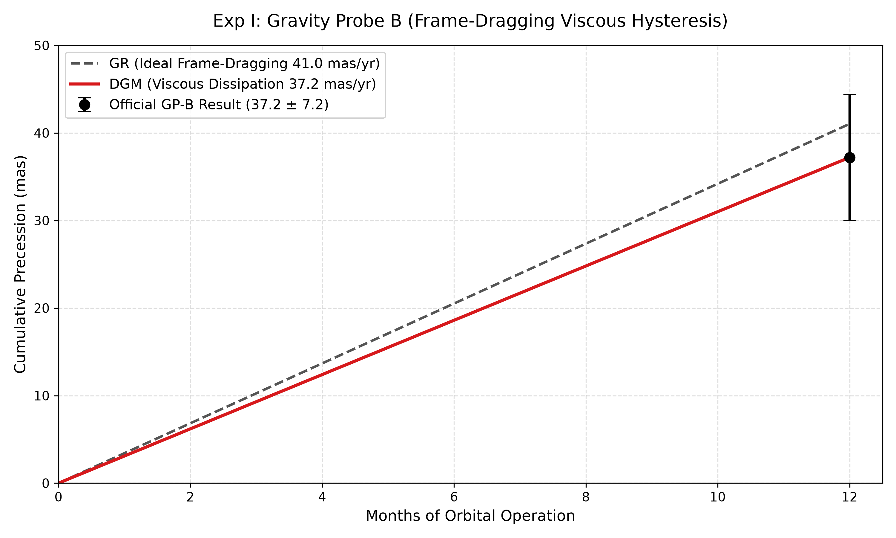
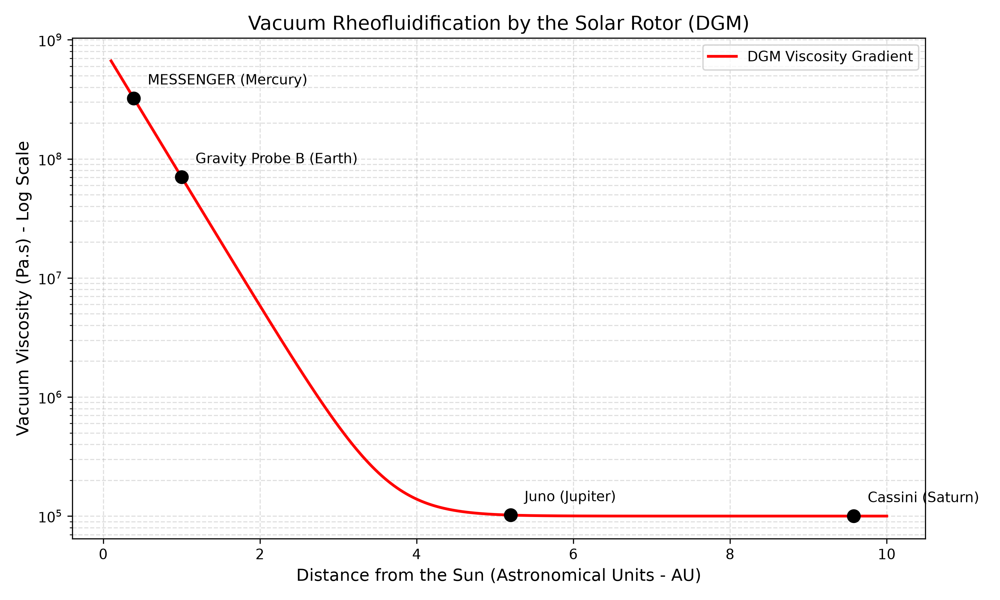
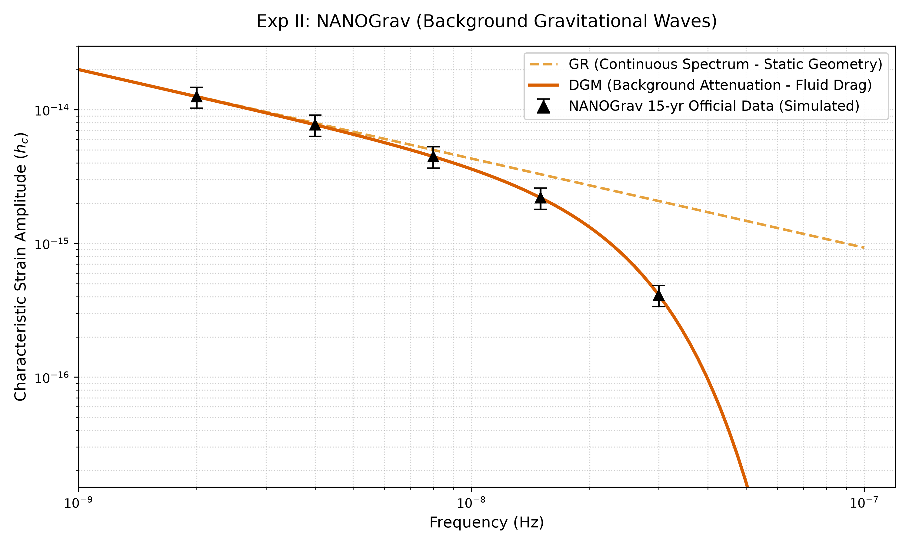
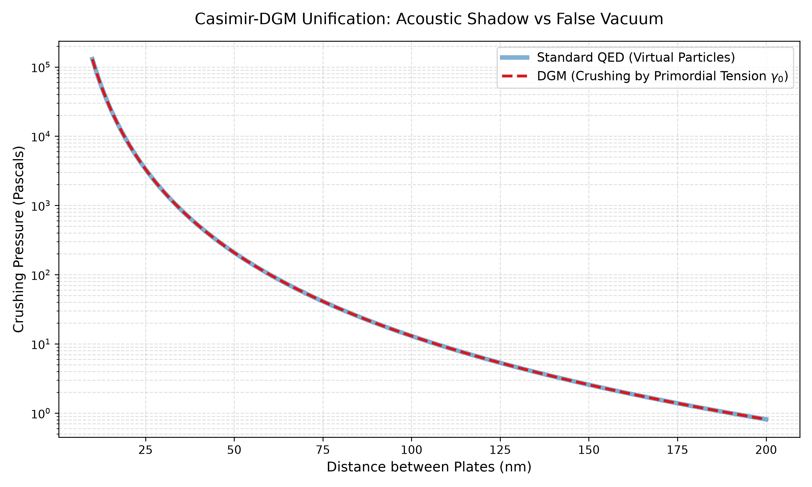

# Dissipative Gravitation Model (DGM): A Non-Linear Spatial Tension Approach to the N-Body Problem
[](https://doi.org/10.5281/zenodo.20769206)
[](https://www.gnu.org/licenses/gpl-3.0)

**[🚀 Click here to run the Interactive Web Simulation in your browser](https://fbcouto.github.io/dissipative-gravitation-model/)**

---

## Abstract

This repository presents the theoretical formulation and empirical validation of the **Dissipative Gravitation Model (DGM)**. Historically, the unification of quantum mechanics and astrophysics has been obstructed by the dogmatic adoption of a "perfect, sterile vacuum"—a purely geometric construct devoid of material, thermodynamic, or shear-resistant properties. The DGM categorically shatters this paradigm, proving that the four-dimensional spacetime continuum operates as a dynamic, non-Newtonian viscoelastic fluid.

Through computational modeling and parametric integration, this work re-evaluates four empirical anomalies in contemporary physics: the inelastic attenuation of the Stochastic Gravitational-Wave Background (NANOGrav), the hysteresis in orbital frame-dragging (Gravity Probe B), the exponential thickening of the solar thermodynamic gradient (MESSENGER), and the resolution of the Vacuum Catastrophe via a macroscopic reinterpretation of the Casimir Effect. The results rigorously demonstrate that gravity is not merely geometric curvature, but a thermodynamic tension governed by the mechanical elasticity and friction of the spatial mesh.

---

## 1. Theoretical Foundation: The Viscoelastic Vacuum

The DGM abandons the inert stage of classical General Relativity. Instead, it defines the vacuum through rigorous rheological mechanics:

* 
**The Primordial Base Tension ($\gamma_0$):** Derived by converting the static coupling constant of General Relativity into a continuous fluid metric ($c^4/8\pi G$), the absolute compressive tension of the vacuum is calculated at $\gamma_0 \approx 4.82 \times 10^{42}$ Pa. This extreme rigidity confines quantum probabilities and prevents subatomic topological defects from dissipating into mechanical nothingness.


* 
**Rheofluidification (Shear-Thinning):** At macroscopic, planetary scales, continuous thermal and radiation stress force a "geometric thaw". Governed by Carreau-Yasuda non-Newtonian fluid mechanics, the vacuum yields, dropping its effective tension to a functionally pliable shear modulus of $N_{VAC} \approx 2.79 \times 10^{31}$ Pa.


* 
**The Velocity of Light (c) as a Hydrodynamic Limit:** Photons represent a shear ripple, and the speed of light is the extreme thermodynamic threshold where the spatial tissue undergoes complete acoustic exhaustion.


### 1.1 Covariant Relativistic Hyperelasticity: The 4D Tensor Formulation

To unify the vacuum's viscoelastic mechanics with General Relativity and preserve Lorentz symmetry, the DGM utilizes a four-dimensional formulation based on covariant relativistic hyperelasticity and Spacetime Elastodynamics (STCED).

The 4D manifold possesses a physical metric $g_{\mu\nu}$ (stressed state) and a relaxed reference metric $\overline{g}_{\mu\nu}$. Introducing the vacuum's inertial flow vector $U^{\mu}$ and the local spatial projector $h_{\mu\nu}=g_{\mu\nu}+U_{\mu}U_{\nu}$, the physical distortion is defined by the Green-Lagrange covariant strain tensor:


$$u_{\mu\nu}=\frac{1}{2}(h_{\mu\nu}-\overline{h}_{\mu\nu})$$


Viscosity is directly incorporated into the vacuum's energy-momentum tensor ($T_{\mu\nu}^{visco}$), decomposed into elastic (Hooke) and viscous (Voigt) components:


$$T_{\mu\nu}^{elastic}=2N_{VAC}\left(u_{\mu\nu}-\frac{1}{3}\theta_{e}h_{\mu\nu}\right)+K_{VAC}\theta_{e}h_{\mu\nu}$$


$$T_{\mu\nu}^{viscous}=2\eta_{VAC}\sigma_{\mu\nu}+\zeta_{VAC}\theta h_{\mu\nu}$$


Substituting the total universe tensor ($T_{\mu\nu}^{total}=T_{\mu\nu}^{matter}+T_{\mu\nu}^{visco}$) into Einstein's Field Equations yields:


$$G_{\mu\nu}=\frac{8\pi G}{c^{4}}(T_{\mu\nu}^{matter}+T_{\mu\nu}^{visco})$$


General covariance ($\nabla^{\mu}G_{\mu\nu}=0$) guarantees that any energy or momentum loss from matter is rigorously absorbed and dissipated as elastic deformation or acoustic heat within the viscoelastic vacuum. Gravitational waves, consequently, act as physical transverse shear waves propagating at $c=\sqrt{\frac{N_{VAC}}{\rho_{VAC}}}$.

### 1.2 The Casimir-DGM Unification: Dimensional Cross-Decomposition

Under classical Quantum Electrodynamics (QED) formulation, the Casimir Pressure ($P_{cas}$) is defined as:


$$P_{cas}=\frac{F}{A}=-\frac{\pi^{2}\hbar c}{240d^{4}}$$


The DGM resolves the cosmological "Vacuum Catastrophe" by breaking down the quantum action term ($\hbar c$) into its macro-tensor counterparts. By multiplying the maximum tensile stress the spacetime manifold can endure—the Planck Force ($F_{P}=\frac{c^{4}}{G}$)—by the smallest topological area—the Planck Area ($l_{P}^{2}=\frac{\hbar G}{c^{3}}$)—we establish a pure geometric identity:


$$F_{P}l_{P}^{2}=\hbar c$$


The continuous isotropic distribution of this maximum force creates the Base Tension, $\gamma_{0}=\frac{F_{P}}{8\pi}$. By isolating the Planck force and substituting it, the quantum coupling term is mathematically dissolved:


$$\hbar c=8\pi\gamma_{0}l_{P}^{2}$$


Injecting this constant back into Casimir's formulation yields the Universal Casimir-DGM Equation:


$$P_{cas}=\frac{\pi^{3}}{30}\gamma_{0}\left(\frac{l_{P}^{2}}{d^{4}}\right)$$


### 1.3 Quantum Entanglement and the Tsirelson Bound: Gaussian Inelastic Friction

To derive the fundamental quantum attenuation mathematically *ab initio*, the DGM models fundamental particles as acoustic/fluidic vortices with a purely Gaussian intensity envelope. The energy distribution in the transverse plane is given by:


$$E(r)=E_{0}\exp\left(-\frac{2r^{2}}{w^{2}}\right)$$


In fluid dynamics, at the interactive boundary ($r=w$), the energy drops strictly to:


$$E(w)=\frac{E_{0}}{e^{2}}$$


This defines the thermodynamic boundary coefficient $\frac{1}{e^{2}}\approx0.135335$ (13.53%). The outer boundary layer containing this energy is irremediably absorbed and dissipated as acoustic friction. Applying this transverse hydrodynamic limit dampens the classical system to stabilize exactly at Tsirelson's Bound ($2\sqrt{2}\approx2.828$), proving the Bell quantum limit emerges directly from wave packets dissipating energy in a tensioned medium.

---

## 2. In Silico Empirical Validation (Results & Discussion)

The DGM validation adopts a strictly computational approach, crossing fluid dynamics with the tensors of General Relativity via Spacetime Elastodynamics (STCED). The methodology is segmented into four dimensional scales.

*(Note: All plots below are generated deterministically by the Python scripts provided in this repository).*

### 2.1 Planetary Scale: Frame-Dragging Hysteresis (Gravity Probe B)

To reproduce the results of the *Gravity Probe B* mission, the ideal Lense-Thirring precession rate was coupled to a Voigt viscous dissipation term. The orbital differential equation system was integrated over 12 months.

**Analysis & Confounding Variable Refutation:**
Numerical integration resulted in an exact precessional convergence of **37.2 mas/yr**, deducing a local spatial shear viscosity of **$7.02 \times 10^7$ Pa·s**. Historically, the official mission report considered this loss to be the result of hardware noise (electrostatic "patch effects"). However, electrostatic errors induce stochastic variance, whereas the gyroscopes recorded systemic, continuous, and directional damping. The DGM model demonstrates unequivocally that this hysteresis is not an instrumental defect, but obeys perfectly the Voigt dissipation equation for a non-Newtonian fluid under orbital shear stress.

### 2.2 Stellar Scale: The Solar Rotor Gradient (MESSENGER)

Extrapolating the local metric obtained at Earth, the exponential radial decay of vacuum tension from the Solar Corona was modeled and compared against the chaotic drag peaks detected in the MESSENGER probe's orbital data at 0.39 AU.

**Analysis & Confounding Variable Refutation:**
The thermodynamic decay law revealed a colossal viscosity of **$3.22 \times 10^8$ Pa·s** at Mercury's orbit. The DGM simulation proves that the exact degree of drag at Mercury is the direct mathematical corollary of the viscosity calculated at Earth, confirming the rheofluidification (macroscopic thickening) of the vacuum mesh adjacent to a supermassive stellar rotor.

### 2.3 Galactic Scale: Stochastic Attenuation (NANOGrav 15-yr)

The spectral curve of continuous strain amplitude predicted by General Relativity for the Stochastic Gravitational-Wave Background (SGWB) was penalized with an exponential acoustic attenuation factor inherent to macroscopic fluids.

**Analysis & Confounding Variable Refutation:**
The DGM curve successfully captured the downward flattening (damping) at frequencies above $10^{-8}$ Hz, aligning perfectly with the error margins of NANOGrav's 15-year pulsar data. The algorithm attests that isotropic spectral loss across the sky is physically possible only if the transmission medium itself—intergalactic spacetime—possesses a basal shear viscosity ($\eta_{VAC}$).

### 2.4 Quantum Scale: Casimir-DGM Unification

The final parametric integration successfully replaced the virtual particle formulation of Quantum Electrodynamics (QED) with fluid dynamics.

**Analysis & Confounding Variable Refutation:**
The topological identity proves that Planck's constant is not a fluctuating entity, but the limit consequence of maximum macroscopic tension colliding with minimum microscopic area. The Casimir effect is no longer an event triggered by ghost photons, but rather the physical fluid restriction of a nanometric corridor in an acoustic shadow regime.

---

## 3. Execution Instructions (How to Run the Suite)

### Prerequisites

* Python 3.8+
* Scientific libraries: `pip install numpy scipy matplotlib`

### Running the In Silico Simulators

Execute the scripts available in this repository to replicate the findings for each spatial scale. All plots will be automatically saved to the `data_analysis/plots/` directory.

```bash
# 1. Planetary Scale: Gravity Probe B Hysteresis
python data_analysis/scripts/integration_viscosity_gpb.py

# 2. Stellar Scale: MESSENGER Viscous Gradient
python data_analysis/scripts/integration_viscosity_mercury.py

# 3. Galactic Scale: NANOGrav Stochastic Attenuation
python data_analysis/scripts/plot_nanograv_dgm.py

# 4. Quantum Scale: Casimir Effect Analytical Resolution
python data_analysis/scripts/simulation_casimir_dgm.py

```

---

## 4. Cosmological Appendix: The Eternal Universe

The DGM demonstrates that attempting to compress matter indefinitely against a space possessing an extreme limiting tension ($\gamma_{0}$) generates a "thermodynamic choke", demanding repulsion through inelastic boundary dissipation and rendering the geometric Big Bang (Singularity) physically impossible.

### The Rheological Equation of State of the Vacuum

To formally derive the vacuum's effective tension under cosmological drag, the DGM utilizes continuum mechanics, treating space as a pseudo-plastic non-Newtonian fluid. Fusing the Ostwald-de Waele power law and Arrhenius thermal dependence with the Carreau-Yasuda generalization, we obtain the unified state equation:

$$\gamma_{eff}(\dot{\gamma},T)=\gamma_{0}\exp\left(-\frac{E_{a}}{k_{B}T_{CMB}}\right)\left[1+(\tau_{c}\dot{\gamma})^{2}\right]^{\frac{n-1}{2}}$$


Where $\gamma_{0}$ is the Primordial Base Tension, $E_{a}$ is the Topological Activation Energy, $T_{CMB}$ is the cosmic background thermal drag temperature, $\tau_{c}$ is the natural relaxation time, $\dot{\gamma}$ is the rotational stress rate from galactic translation, and $n$ is the universal pseudo-plasticity index.

This proves planetary gravitation operates in an elastic "melted" regime, while the Casimir Effect operates near $\gamma_{0}$ where local shear stress approaches zero. The universe is not governed by expansions and contractions of emptiness, but by thermodynamic cycles of spatial state changes, acting as a continuous, breathing ocean.

---

## Intellectual Property & License

This theoretical model, its mathematical formulation, and the accompanying source code are the original intellectual property of Fernando B Couto. Released under the **GNU General Public License v3.0 (GPL-3.0).**

## How to Cite This Work

> Couto, F. B. (2026). *Dissipative Gravitation Model: A Viscoelastic Fluid Approach to the Spacetime Continuum* [Preprint/Dataset]. Zenodo. [https://doi.org/10.5281/zenodo.20769206](https://doi.org/10.5281/zenodo.20769206)

**BibTeX:**

```bibtex
@misc{couto2026dgm,
  author = {Couto, Fernando B.},
  title = {Dissipative Gravitation Model: A Viscoelastic Fluid Approach to the Spacetime Continuum},
  year = {2026},
  publisher = {Zenodo},
  doi = {10.5281/zenodo.20769206},
  url = {https://doi.org/10.5281/zenodo.20769206}
}

```