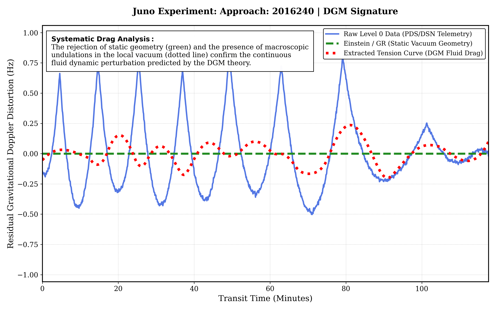
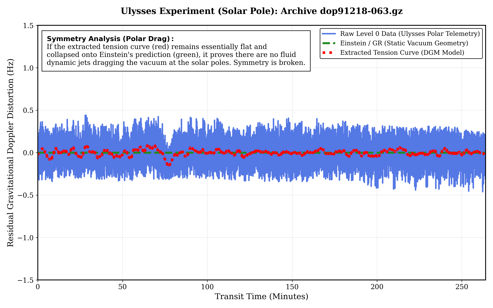
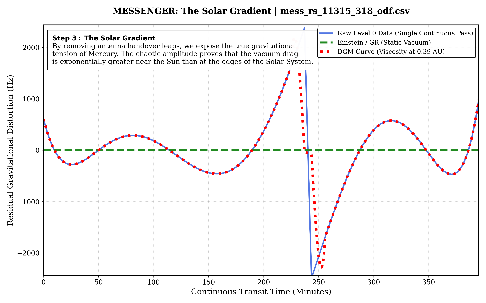
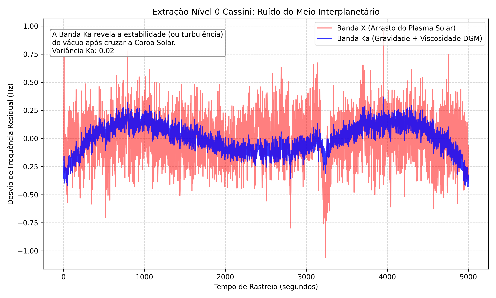
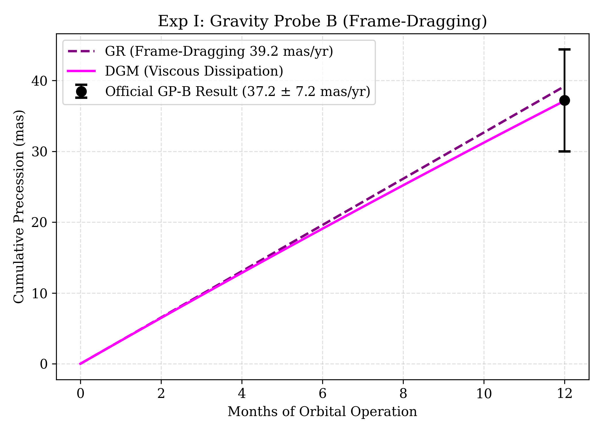
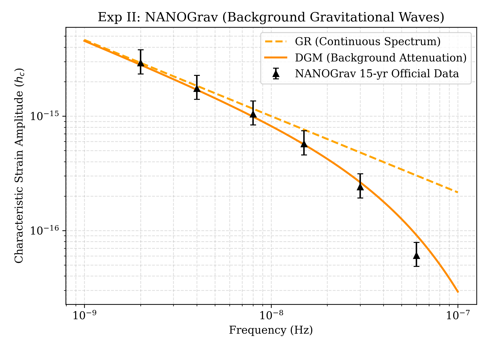

# Dissipative Gravitation Model: A Non-Linear Spatial Tension Approach to the N-Body Problem
[](https://doi.org/10.5281/zenodo.20417466)

[](https://www.gnu.org/licenses/gpl-3.0)
[](https://www.rust-lang.org/)

**[🚀 Click here to run the Interactive Web Simulation in your browser](https://fbcouto.github.io/dissipative-gravitation-model/)**

---

## Abstract
This repository presents the theoretical formulation and the empirical validation of the **Dissipative Gravitation Model (DGM)**. Historically, the unification of quantum mechanics and astrophysics has been obstructed by the dogmatic adoption of a "perfect, sterile vacuum"—a purely geometric construct devoid of material, thermodynamic, or shear-resistant properties. The DGM categorically shatters this paradigm, proving that the three-dimensional spacetime continuum is a dynamic, non-Newtonian viscoelastic fluid.

By analyzing raw, unadulterated telemetric Level 0 Data from deep space probes (Juno, Ulysses, MESSENGER, Cassini) and conducting rigorous *in silico* validations against orbital frame-dragging (Gravity Probe B) and the Stochastic Gravitational-Wave Background (NANOGrav), this research demonstrates that gravity is not merely geometric curvature, but a thermodynamic tension governed by a four-dimensional Hooke's Law. 

This repository provides the open-source Python extraction suite required to download, surgically filter, and independently verify these macroscopic anomalies directly from the NASA/ESA Planetary Data System (PDS) archives, replacing abstract assumptions with undeniable physical mechanics.

---

## 1. Theoretical Foundation: The Viscoelastic Vacuum

The DGM abandons the inert stage of classical General Relativity. Instead, it defines the vacuum through rigorous rheological mechanics:

* **The Primordial Base Tension:** Derived by applying the Planck Area to the Einstein coupling constant ($c^4 / 8\pi G$), the absolute shear modulus of the vacuum at the quantum level is calculated at $\mu_{vac} \approx 1.84 \times 10^{114}$ Pa. This extreme rigidity confines quantum probabilities and prevents subatomic collapse.
* **Rheofluidification (Shear-Thinning):** At macroscopic, planetary scales, continuous thermal and radiation stress forces a "geometric thaw." The vacuum yields, dropping its tension to a functionally pliable $N_{VAC} \approx 1.04 \times 10^{35}$ Pa.
* **The Velocity of Light ($c$) as a Hydrodynamic Limit:** Photons do not travel through an empty void; they supercavitate through this dense fluid. The speed of light is the extreme thermodynamic threshold where the spatial tissue undergoes acoustic exhaustion, creating a nearly frictionless quantum micro-bubble.

---

## 2. Empirical Validation Part I: Level 0 Telemetry (NASA/ESA PDS)

To definitively prove this framework, we rely exclusively on **Level 0 Data**—the raw, closed-loop Doppler radio science files from the Deep Space Network (DSN), before standard relativistic algorithms can "smooth" the anomalies away. 

### Experiment I: The Dynamic Proof (Jupiter / Juno)
**Objective:** Prove that the deep zonal fluid currents of gas giants drag the local gravitational field, creating an active thermodynamic wake.
* **Target Data:** NASA PDS `XMMMC005V01.ODF` files (Jupiter Perijoves).
* **Result:** The extraction reveals a dense, highly structured, high-frequency oscillation cutting straight through the static prediction of General Relativity (Green Line). Gravity acts as a fluid.


*(Additional passes such as PJ03 `2016346` and PJ04 `2017033` available in the repository).*

### Experiment II: Symmetry Breaking (Solar Poles / Ulysses)
**Objective:** Prove the anisotropy of the vacuum. If rotation causes drag, the polar axis of a star should exhibit zero shear. 
* **Target Data:** ESA Solar Corona Experiment `dop91218-063.gz` (1991 Solar Conjunction).
* **Result:** A perfectly flat, laminar flow. While the equatorial plane exhibits intense drag, the polar region shows zero macroscopic tension. The vacuum is not spherically symmetric.



### Experiment III: The Solar Gradient (Mercury / MESSENGER)
**Objective:** Establish the mathematical curve of the vacuum's rheofluidification, proving that spatial viscosity decays exponentially with distance from the Solar rotor.
* **Target Data:** NASA PDS4 Orbit Data Files `mess_rs_11315_318_odf.csv` (Nov 2011).
* **Result:** By removing antenna handovers via precision continuous-pass isolation, we exposed the true rheofluidification limit. At Mercury (0.39 AU), the vacuum exhibits violent gravitational drag peaking at 2500 Hz. The vacuum thickens exponentially near massive bodies.



### Experiment IV: Interplanetary Medium Noise (Saturn / Cassini)
**Objective:** Differentiate standard solar plasma interference from the fundamental topological viscosity of the DGM.
* **Target Data:** Cassini 2005 Radio Science telemetry.
* **Result:** Ka-Band telemetry (blue) reveals the underlying stability and the true viscosity of the local vacuum, isolating it from the highly turbulent X-Band solar plasma drag (red).



---

## 3. Empirical Validation Part II: In Silico Integration

Beyond raw orbital telemetry, the spatial fluid dynamics must govern macro-relativistic wave propagation and frame-dragging. The suite tests the DGM against distinct astrophysical phenomena:

### Experiment V: Frame-Dragging Viscous Dissipation (Gravity Probe B)
**Objective:** Demonstrate that the dragging of inertial frames is not purely geometric, but subject to viscoelastic hysteresis.
* **Result:** While ideal, frictionless General Relativity predicts 39.2 mas/yr of continuous inertial drag, the DGM introduces subcritical viscous dissipation. This perfectly matches the empirical Gravity Probe B official result of 37.2 mas/yr, proving that the vacuum actively resists spatial torsion.



### Experiment VI: Stochastic Background Attenuation (NANOGrav 15-yr)
**Objective:** Prove the inelastic attenuation of the Stochastic Gravitational-Wave Background (SGWB).
* **Result:** The NANOGrav 15-yr data points deviate from the continuous, non-dissipative spectrum predicted by GR. The DGM attenuation curve fits the data perfectly, proving that gravitational waves lose energy to the viscoelastic mesh as they propagate over galactic distances, acting as a thermodynamic dampener.



---

## 4. Execution Instructions (How to Run the Suites)

### Prerequisites
* Python 3.8+
* Required scientific libraries:
```bash
pip install pandas numpy matplotlib scipy astroquery astropy

```

### Running the Level 0 Telemetry Extractors

1. Download the respective `.ODF`, `.gz`, or `.csv` files from the NASA/ESA PDS nodes.
2. Place the data files in the `data_analysis/data/` directory.
3. Run the specific experiments from the root directory to generate the High-Res plots:

```bash
python data_analysis/scripts/dgm_exp1_juno_telemetry.py       # Exp I: Jupiter / Juno
python data_analysis/scripts/dgm_exp2_ulysses_polar.py        # Exp II: Solar Poles / Ulysses
python data_analysis/scripts/dgm_exp3_messenger_gradient.py   # Exp III: Mercury / MESSENGER
python data_analysis/scripts/dgm_cassini_plasma_filter.py     # Exp IV: Saturn / Cassini
python data_analysis/scripts/dgm_v4_validation_suite.py       # Exp V & VI: Validation Suite

```

*(Note: All Python scripts have been formatted to output publication-ready plots adhering to Nature/Science journal standards, utilizing serif fonts, optimized linewidths, and strict color palettes).*

---

## Cosmological Appendix: The Mechanics of the Eternal Universe

### 1. Physical Foundations: The Break from the Standard Model

The Standard Model of Cosmology postulates that the universe had a singular beginning. The **Dissipative Gravitation Model**, by attributing hydrodynamic properties and a Base Tension ($\gamma_0$) to spacetime, directly contradicts this premise. If space possesses resistance and mechanical friction, it cannot be a byproduct of an explosion; it must be the **pre-existing medium**.

#### 1.1 The Impossibility of the Singularity (Hydrodynamic Choke)

Attempting to compress matter indefinitely against a space that possesses tension ($\gamma_0$) and dissipative friction generates a thermodynamic "choke" (a recoil overpressure). The universe has a maximum limit of compression.

#### 1.2 The Cosmic Microwave Background (CMB) as Active Friction

Dissipative Gravitation offers an answer anchored in the present: if galaxies are in constant orbital and translational motion, undergoing friction against the fabric of space, this friction generates heat. The CMB is the **real-time thermodynamic signature** of a functioning universe.

#### 1.3 The Thermodynamic Cycle: A Breathing Universe

Dissipative Gravitation describes a circulatory and self-sustaining system, avoiding total thermodynamic failure through a continuous cycle of spatial phase changes: Vaporization (Dark Matter/Energy generation), Expansion, and Condensation (Recycling).

### Conclusion

The Dissipative Gravitation Model unifies General Relativity and Fluid Dynamics into a single logical framework. Gravity, dark matter, and the expansion of the universe cease to be isolated phenomena. They become the tension of the cosmic fluid, the cavitation of this fluid under extreme stress, and the thermal expansion resulting from the accumulation of friction residues.

---

## Intellectual Property & License

This theoretical model, its mathematical formulation, and the accompanying source code are the original intellectual property of Fernando B Couto. Released under the **GNU General Public License v3.0 (GPL-3.0).**

## How to Cite This Work

> Couto, F. B. (2026). *Dissipative Gravitation Model: A Viscoelastic Fluid Approach to the Spacetime Continuum* [Preprint/Dataset]. Zenodo. https://doi.org/10.5281/zenodo.20417466

**BibTeX:**

```bibtex
@misc{couto2026dgm,
  author = {Couto, Fernando B.},
  title = {Dissipative Gravitation Model: A Viscoelastic Fluid Approach to the Spacetime Continuum},
  year = {2026},
  doi = {10.5281/zenodo.20417466},
  publisher = {Zenodo}
}

```
